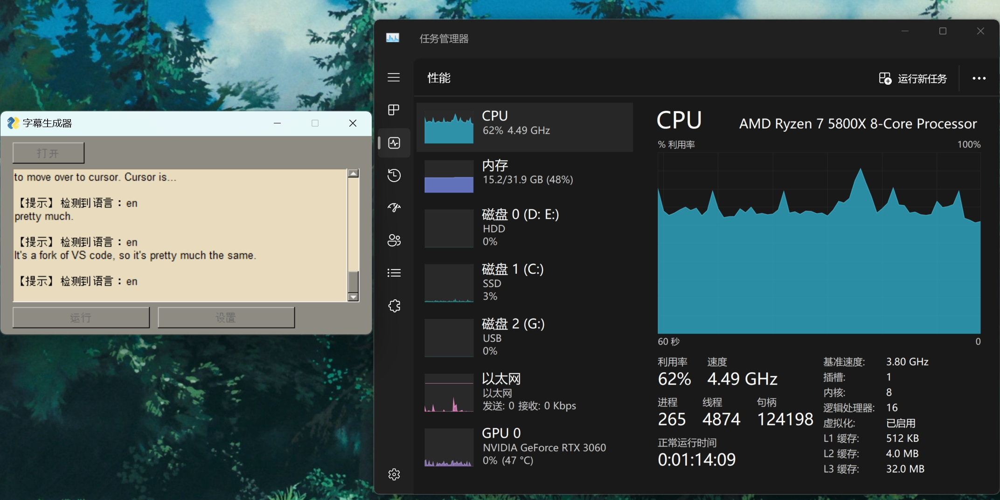
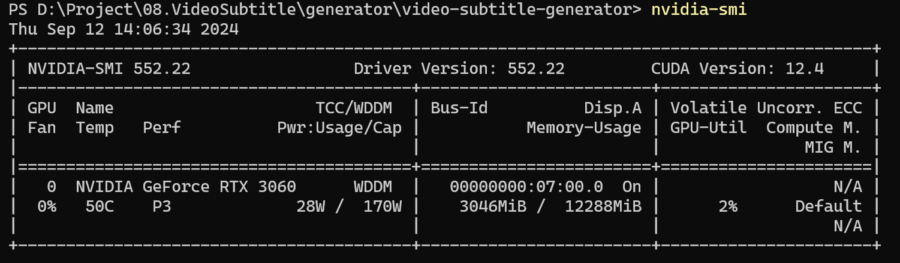

+++
title = "视频字幕生成软件部署"
date = 2024-09-12
updated = 2024-09-12
+++

前面后面可能需要提取一些视频文案，刚好前几天看到一个推荐对视频字幕进行操作的几个仓库（ 生成 [Video Subtitle Generator](https://github.com/YaoFANGUK/video-subtitle-generator)、提取 [Video Subtitle Extractor](https://github.com/YaoFANGUK/video-subtitle-extractor)、去除 [Video Subtitle Remover](https://github.com/YaoFANGUK/video-subtitle-remover/tree/main)），昨天部署了下，踩了些坑，记录一下解决方法。

首先安装 [仓库](https://github.com/YaoFANGUK/video-subtitle-generator) 的 readme 文件去进行 下载安装Miniconda、创建并激活虚机环境、安装依赖文件，这几步都没遇到什么问题。

然后在执行 'python gui.py' 进行运行图形化界面版本(GUI)时，报了 'No module named 'fsplit'' 的问题，这个库安装出错了，后面参考 [issue](https://github.com/YaoFANGUK/video-subtitle-generator/issues/23) 里面最后的 'pip install filesplit==3.0.2' 这个操作安装成功了，好像是原来默认下载的 fsplit 的库是 python2 的，不适配，换了 python3 的库就好了。

后面解决之后继续执行 'python gui.py' 运行图形化界面，后面打开视频是报错还有有些库没装上，然后通过 'pip install xxx' 手动一个个装上就可以了，另外可以在命令后加上 '-i https://pypi.tuna.tsinghua.edu.cn/simple' 加快安装速度。

现在跑起来字幕生成，发现有显卡一动不动，CPU 占用特别高的情况，在 issue 链接里面看到别人好像也遇到了同样的 [问题](https://github.com/YaoFANGUK/video-subtitle-generator/issues/21)，一会我试试能不能解决。

用 CPU 跑，12 分钟视频，300 行字幕，跑了 2779s。

那个方法解决不了，现在试这个 [方法](https://github.com/YaoFANGUK/video-subtitle-generator/issues/28) 重新安装 [CUDA和torch](https://blog.csdn.net/Bellwen/article/details/124734847)

nvidia-smi 查看自己电脑支持 CUDA 的最高版本，（向下兼容？）

> 向下兼容，又称向后兼容（Backwards compatibility），计算机术语。向下兼容常常是相对于向上兼容而言的，两者在兼容的方向性上是相反的，因此这两个概念是不同的。向下兼容（Downward Compatibility），又称作向后兼容（Backward Compatibility）。在计算机中指在一个程序或者类库更新到较新的版本后，用旧的版本程序创建的文档或系统仍能被正常操作或使用，或在旧版本的类库的基础上开发的程序仍能正常编译运行的情况。例如较高档的计算机或较高版本的软件平台可以运行较为低档计算机或早期的软件平台所开发的程序，如基于Pentium微处理器的PC兼容机可以运行早期在486上运行的全部软件。向下兼容可以使用户在进行软件或硬件升级时，厂商不必为新设备或新平台从头开始编制应用程序，以前的程序在新的环境中任然有效。

命令
pip install filesplit==3.0.2

pip install xxx -i https://pypi.tuna.tsinghua.edu.cn/simple

nvidia-smi

pip uninstall torch

conda install pytorch==2.4.0 torchvision==0.19.0 torchaudio==2.4.0 pytorch-cuda=12.1 -c pytorch -c nvidia

参考链接
[链接1](https://blog.csdn.net/Bellwen/article/details/124734847)
[链接2](https://blog.csdn.net/Zinnir/article/details/122766367)
[链接3](https://blog.csdn.net/m0_37605642/article/details/98854753)
[CUDA 下载链接](https://developer.nvidia.com/cuda-toolkit-archive)
[pytorch 版本](https://pytorch.org/get-started/previous-versions/)
